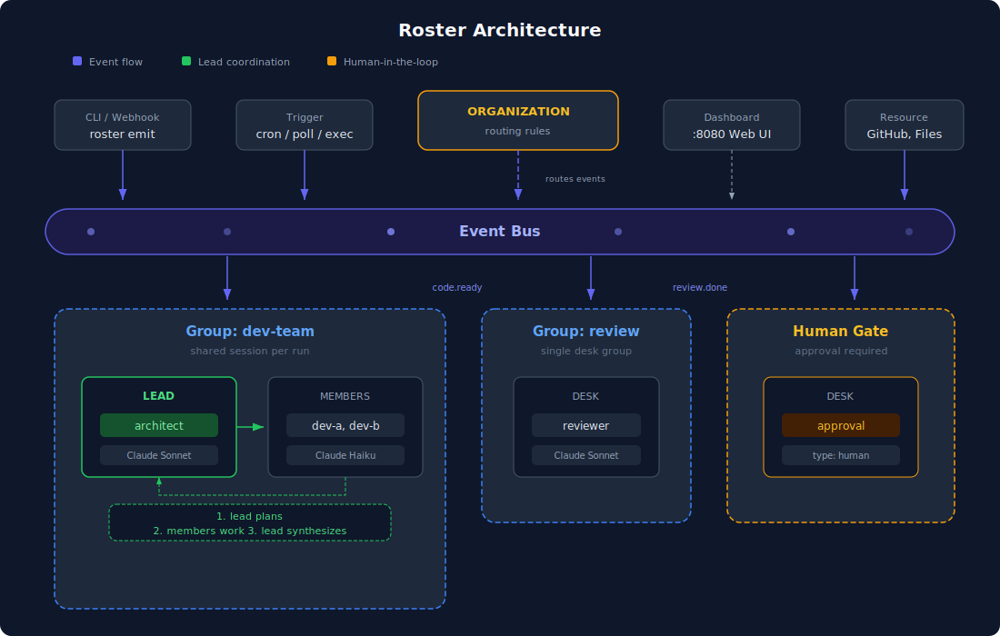

# Roster

**Run AI agent teams the way you'd run a real organization — just YAML.**

Roster is an AI agent orchestration framework built in Go. Define agents, assign them desks, form teams, route events between them, and watch them work through a live dashboard.

No code required. Declare your organization in YAML, and Roster handles execution, coordination, and state.

[한국어 문서](docs/ko/)

---

## Architecture

<p align="center">
  
</p>

Every desk is an independent actor. Desks receive events, do work, and emit events. The event bus connects everything — no direct calls between desks, no shared mutable state. Groups coordinate teams within a run. The organization routes events to the right place.

---

## Install

**Download a pre-built binary** from the [Releases](https://github.com/roster-io/roster/releases) page:

```bash
# macOS (Apple Silicon)
curl -L https://github.com/roster-io/roster/releases/latest/download/roster-darwin-arm64 -o roster
chmod +x roster
sudo mv roster /usr/local/bin/
```

**Or build from source** (requires Go 1.22+):

```bash
git clone https://github.com/roster-io/roster
cd roster
make install
```

---

## Quick Start

```bash

# Create a new organization
roster init my-org
cd my-org

# Set your API key
export ANTHROPIC_API_KEY=sk-ant-...

# Validate config
roster dry-run .

# Start the hub with web dashboard
roster hub --ui :8080

# Send your first task (in another terminal)
roster emit task.created "Write a Go function that checks if a number is prime"
```

Open http://localhost:8080 to see the dashboard.

> See the full [Quickstart Guide](docs/en/quickstart.md) for a step-by-step walkthrough.

---

## Core Concepts

```
You (the CEO)
├── Hire agents       → agents/writer.yaml    (who they are, what skills they have)
├── Assign desks      → desks/writer.yaml     (which AI/tool they use)
├── Form teams        → groups/content.yaml   (who works together)
└── Set up routing    → organization.yaml     (which events go where)
```

### Agent

A reusable role with skills. Skills are prompt files that define what the agent knows.

```yaml
kind: agent
name: writer
skills:
  - draft-article     # local file: skills/draft-article.md
```

### Desk

An agent's workstation. Defines how work gets executed.

```yaml
kind: desk
name: writer
executor:
  type: api
  sdk: anthropic
  params:
    model: claude-sonnet-4-6
  env:
    ANTHROPIC_API_KEY: "${ANTHROPIC_API_KEY}"
```

Executor types:

| Type | Description |
|------|-------------|
| `api` | Built-in SDK (Anthropic, OpenAI, Gemini) |
| `exec` | Any command (bash, python, ollama, etc.) |
| `docker` | Docker container |
| `remote` | Remote worker via gRPC |
| `human` | Human responds via web UI |

### Group

A team of desks that share context. When activated, members collaborate through a shared communication space.

```yaml
kind: group
name: content-team
desks:
  - researcher
  - writer
  - editor

lead:
  desk: writer
  position: both   # plan first, synthesize after team work

subscribe:
  - task.created
emit:
  - content.published
```

### Organization

The top-level system. Defines groups and routes events between them.

```yaml
kind: organization
name: my-org

groups:
  - content-team
  - review-squad

routing:
  - on: task.created
    to: content-team
  - on: content.published
    to: review-squad
```

---

## Web Dashboard

`roster hub --ui :8080` starts a management dashboard.

- **Graph View** — live visualization of your organization, nodes light up as desks work
- **Runs View** — execution history with per-step drill-down (output, tokens, cost, duration)
- **Routing View** — event routing table between groups and desks
- **Top Bar** — live counters for desks, events, and cumulative cost

---

## Triggers

Automate work with triggers on desks or groups:

```yaml
triggers:
  - type: exec
    command: "./scripts/check-issues.sh"
    interval: "5m"
```

| Type | Description |
|------|-------------|
| `exec` | Run a script on interval. Exit 0 = fire |
| `poll` | HTTP poll. 200 + body = fire |
| `webhook` | `POST /webhooks/{id}` fires the event |
| `cron` | Standard cron expression |

---

## Human-in-the-Loop

Use `type: human` for approval gates or manual input. Respond through the web dashboard.

```yaml
kind: desk
name: approval-gate
executor:
  type: human
subscribe:
  - content.published
emit:
  - content.approved
```

---

## CLI Reference

```bash
roster init [dir]                    # Scaffold a new organization
roster dry-run [dir]                 # Validate config + simulate routing
roster hub [--dir .] [--ui :8080]    # Start the hub
roster emit <event> [payload]        # Emit an event
roster logs [--follow]               # View execution logs
roster runs [--output]               # View run history
roster status                        # Check hub status
```

---

## Repository Structure

```
roster/
├── roster/          # Framework core (Go)
│   ├── cmd/roster/  # CLI entrypoint
│   ├── pkg/         # Public interfaces (types, sdk)
│   └── internal/    # Implementation
├── docs/
│   ├── en/          # English documentation
│   └── ko/          # Korean documentation
├── examples/        # Example organizations
├── LICENSE          # Apache 2.0
└── Makefile
```

## License

Apache 2.0
